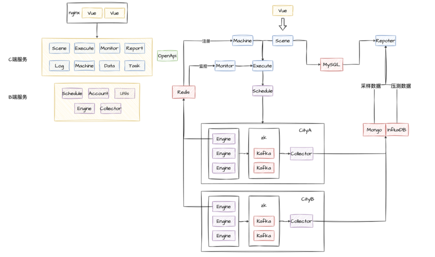
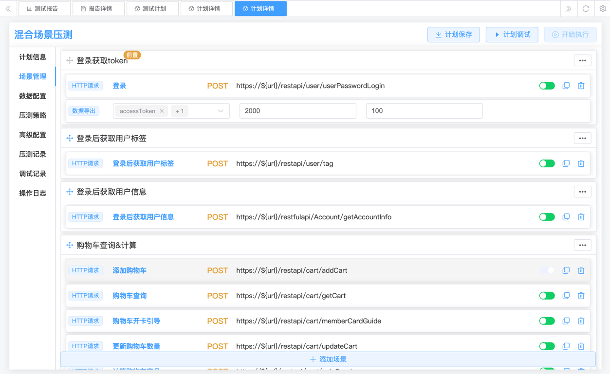
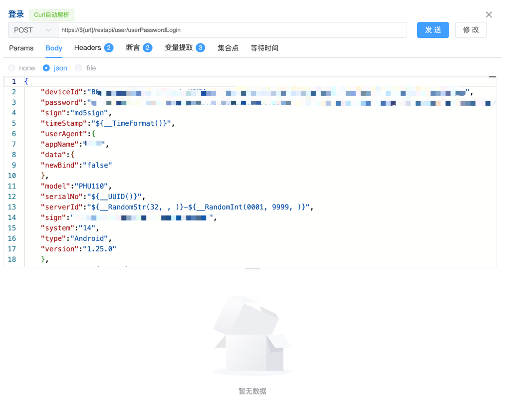
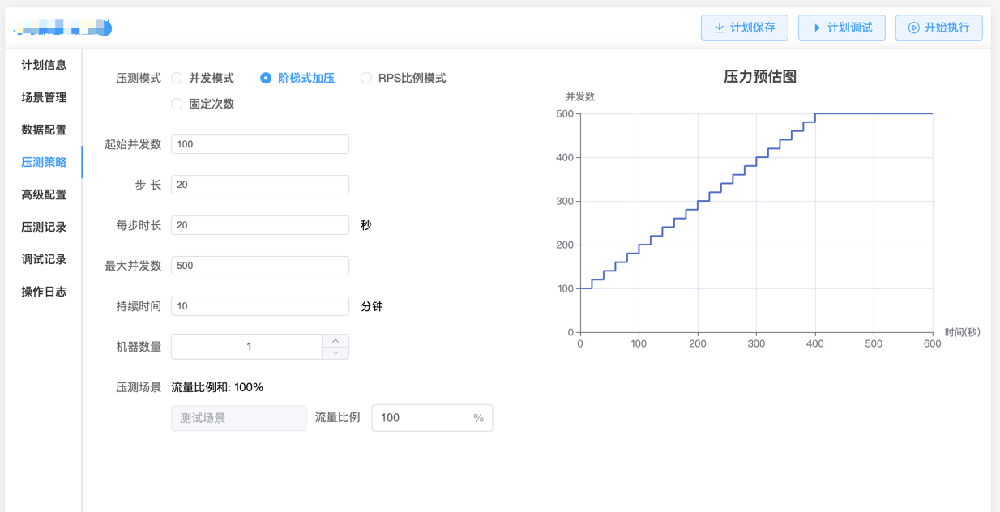
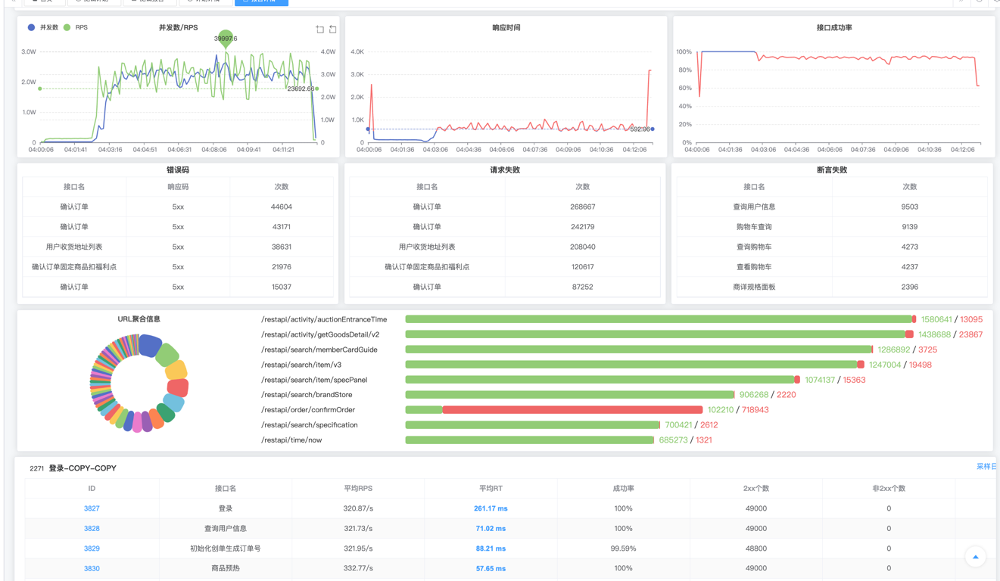

# 泰山接口压测平台 🏔️

## 🌟 项目简介

泰山接口压测平台是基于精准测试理念构建的新一代智能压测系统，通过代码变更分析自动识别影响范围，实现精准化、常态化的性能验证闭环。

## 🛠️ 技术栈

| 领域        | 技术选型                                                              |
|-------------|-------------------------------------------------------------------|
| **前端**    | Node.js 18.16.0 + Vue 3 + TypeScript + Element Plus + ECharts     |
| **后端**    | Golang 1.20 + Gin + GORM Gen                                      |
| **存储**    | MySQL (业务数据) + Redis(缓存) + InfluxDB (施压数据) + Kafka + OSS(参数化文件存储) |
| **压测引擎**| 自研Go压测引擎                                                          |

## ⚡ 分布式能力
支持百万级并发压力

动态资源调度算法

多地域联合压测

## 🏗️ 系统架构

## 🖼️ 核心功能界面预览
场景管理

接口编辑

压测模式

测试报告

## 🚦 快速开始
1. 执行scene/sql文件内所有文件，生成对应mysql表
2. 配置各项目的conf.yml
3. 前端启动 node install && pnpm dev
4. 服务端启动，各项目跟目录go run main.go